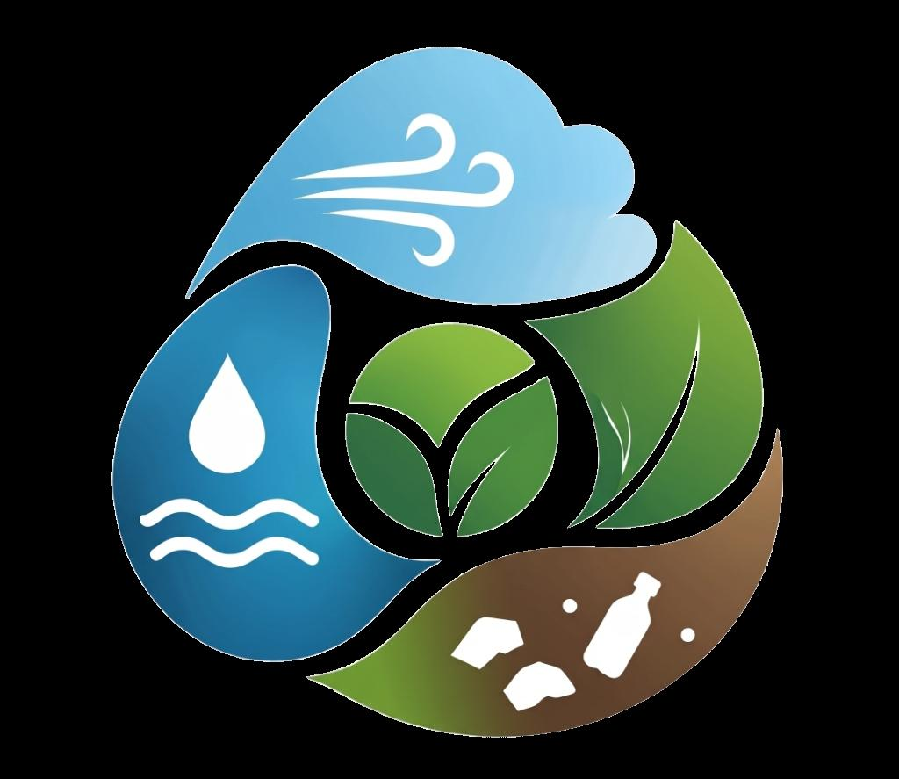
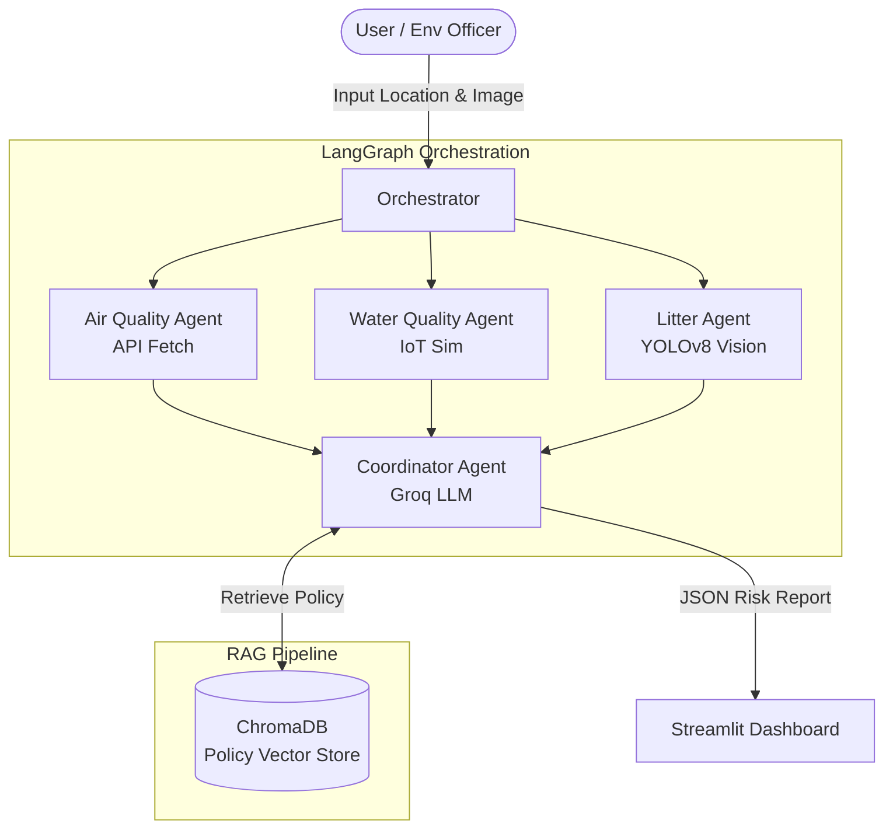

# 🌍 EcoTriBlend: Multi-Modal Agentic Environmental Monitor



**EcoTriBlend** is an advanced, multi-agent AI orchestration platform designed for real-time urban environmental monitoring. Built for city municipalities and environmental officers, it fuses three distinct data modalities—Live APIs, simulated IoT endpoints, and local Computer Vision—into a single pane of glass, governed by an LLM Coordinator.

## 🚀 Key Features

* **🤖 LangGraph Agent Orchestration:** Sequences independent specialist agents into a robust state graph.
* **🌬️ Live API Tool Calling (Air Agent):** Dynamically geocodes global locations to pull live Air Quality Index (AQI) and weather telemetry.
* **💧 Deterministic IoT Simulation (Water Agent):** Uses cryptographic hashing to simulate hyper-local pH, turbidity, and coliform sensors.
* **👁️ Edge ML Computer Vision (Litter Agent):** Runs local YOLOv8 object detection on field imagery to quantify waste contamination.
* **🧠 LLM Coordinator:** Synthesizes the divergent signals to output an actionable, mathematically-grounded risk assessment.
* **📚 Policy RAG Pipeline:** Fully integrated LangChain & ChromaDB Vector Store that retrieves official WHO environmental regulations to legally ground the Coordinator's decisions.
* **🗺️ 3D PyDeck Radar:** Interactive, glitch-free visualization of the monitoring zone.

## 🛠️ Architecture



## ⚙️ Installation & Quick Start

1. **Clone the repository:**
   ```bash
   git clone https://github.com/Finey10/EnvMon.git
   cd EnvMon
   ```

2. **Install dependencies:**
   ```bash
   pip install -r requirements.txt
   ```

3. **Set up Environment Variables:**
   Create a `.env` file in the root directory and add your API keys:
   ```env
   GROQ_API_KEY=your_groq_key_here
   OPENWEATHERMAP_API_KEY=your_owm_key_here
   ```

4. **Run the Dashboard:**
   ```bash
   streamlit run app.py
   ```

## 🏆 Hackathon Technical Achievements
- **Core Pipeline Completeness:** Integrated a pure-Python TF-IDF/Chroma RAG pipeline with loaders, splitters, embedders, and retrievers.
- **Agent Reasoning:** Strict LangGraph execution sequencing with deterministic fallback states.
- **Tool Calling:** The Groq-powered Coordinator agent uses native strict JSON Schema tool calling (`tool_choice`).
- **UX/UI Polish:** Built a "beyond-chat" interface featuring dark glassmorphism, toast notifications, stateful rendering, and 3D map plotting.

---
*Built with ❤️ for a cleaner, smarter planet.*
